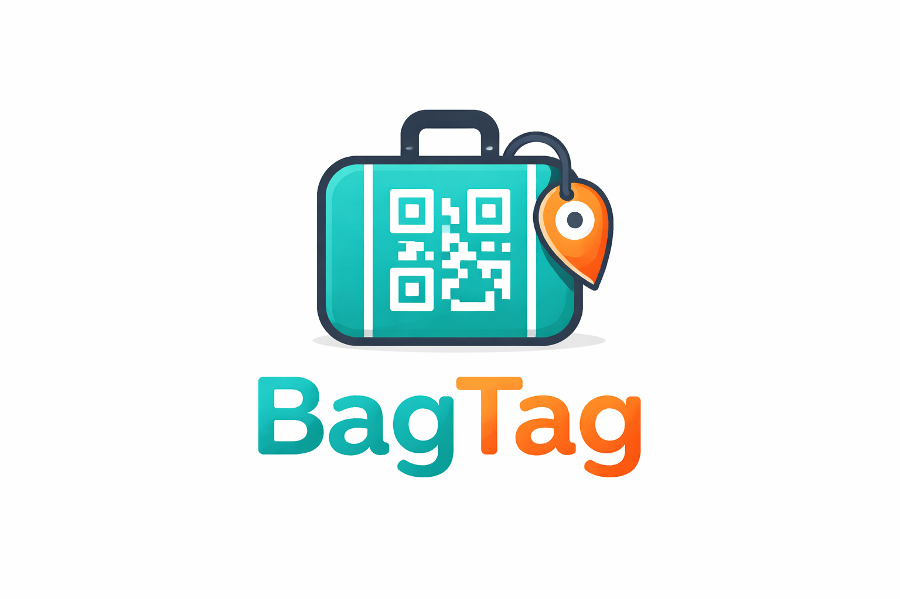

# BagTag

BagTag is a self-hosted luggage tag system built around QR codes. A scanned tag should open a privacy-preserving public page where someone can report a bag's location without seeing the owner's identity, while the owner manages tags and scan history through an authenticated app.

The repository now has working local auth, generated frontend API bindings, Dockerized app/runtime
separation, and a Flyway-managed PostgreSQL schema. Tag management and public reporting flows are
still in progress.

## Current State

- `apps/web` is an Angular 21 SPA with public, login, owner, and about routes.
- `apps/api` is a Spring Boot 4 app with health, magic-link auth, session, profile, and Flyway-backed PostgreSQL persistence for users and magic-link tokens.
- `deploy/` contains Helm and environment scaffolding, but the workflow and deployment scripts are still placeholders.
- `docs/architecture.md` describes the intended product and system design.
- `docs/tasks.md` tracks the MVP backlog.

## Repository Layout

```text
apps/
  api/      Spring Boot backend bootstrap
  web/      Angular frontend bootstrap
deploy/     Helm chart, env values, deploy script placeholders
docs/       Architecture, tasks, and ADRs
```

## Local Development

### Frontend

Requirements:

- Node.js
- npm

Run:

```bash
cd apps/web
npm install
npm start
```

The Angular dev server runs at `http://localhost:4200`.

Generated API client workflow:

```bash
cd apps/web
npm run api:fetch
npm run api:generate
```

Or in one step:

```bash
cd apps/web
npm run api:sync
```

Notes:

- The backend serves OpenAPI docs at `http://localhost:8080/v3/api-docs`
- The checked-in OpenAPI document lives at `openapi/bagtag-api.json`
- `ng-openapi-gen` generates the Angular client into `apps/web/src/app/generated/bagtag-api`
- Frontend API integrations should use the generated client rather than hand-rolled `HttpClient` calls
- Owner display names are editable through the owner area; when set, they take precedence over the
  email address in the UI

### Backend

Requirements:

- Java 25
- PostgreSQL

Run:

```bash
cd apps/api
./gradlew bootRun
```

By default, the API expects PostgreSQL at `jdbc:postgresql://localhost:5432/bagtag` with
`bagtag` / `bagtag`, and Flyway runs database migrations at application startup for local
development.

That setup is intended to work with PostgreSQL running in Docker Compose while the API itself runs
locally from IntelliJ or the terminal on the host machine.

Run tests:

```bash
cd apps/api
./gradlew test
```

## Containers

Each app now has its own Dockerfile:

- `apps/web/Dockerfile` builds the Angular app and serves it from Nginx.
- `apps/api/Dockerfile` builds a Spring Boot jar and runs it on Java 25.

Run the full local stack with Docker Compose from the repo root:

```bash
docker compose up --build
```

The stack reads local configuration from `.env`. A committed template lives in `.env.example`.

Services:

- Web UI: `http://localhost:4280`
- API: `http://localhost:8180`
- Postgres: `localhost:5432`

These Docker ports intentionally do not overlap with the default local dev ports used by Angular (`4200`) and Spring Boot (`8080`), so you can run IntelliJ and Docker side by side.

The web container proxies `/api/*` to the API container, which keeps the browser-side shape close to a future ingress setup in Kubernetes.

For local Docker development, the API container runs Flyway on startup against the Compose
PostgreSQL container. In k3s, Flyway should run in an init container before the API pod starts so
schema changes complete before the app begins serving traffic.

Optional email and magic-link configuration:

```bash
export RESEND_API_KEY=...
export RESEND_FROM_EMAIL=hello@your-domain.example
export RESEND_FROM_NAME=BagTag
export RESEND_REPLY_TO=support@your-domain.example
docker compose up --build
```

## Documentation Map

Use the code for the current truth of the project and the docs for target shape and backlog:

- [`docs/architecture.md`](docs/architecture.md) explains the planned system, privacy model, flows, and deployment approach.
- [`docs/tasks.md`](docs/tasks.md) is the working MVP backlog.

The docs are still slightly ahead of implementation, but they now track the current auth, API-generation, and database setup closely.

## Versioning

BagTag uses repo-wide SemVer with a single canonical version in [`VERSION`](VERSION).

Update it with:

```bash
./scripts/version.sh bump patch
./scripts/version.sh bump minor
./scripts/version.sh bump major
./scripts/version.sh set 0.2.0
```

The script syncs version metadata across the backend, frontend, and Helm chart. GitHub Actions can also run the same tool through the `Version Bump` workflow.
